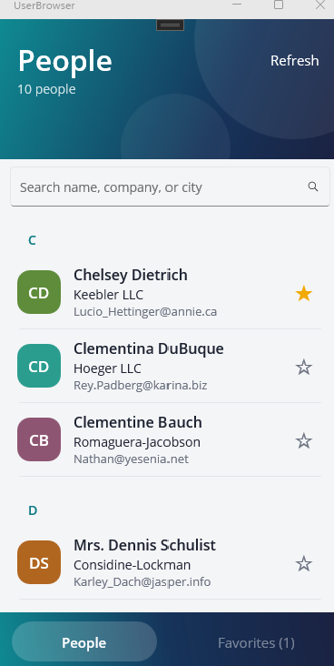
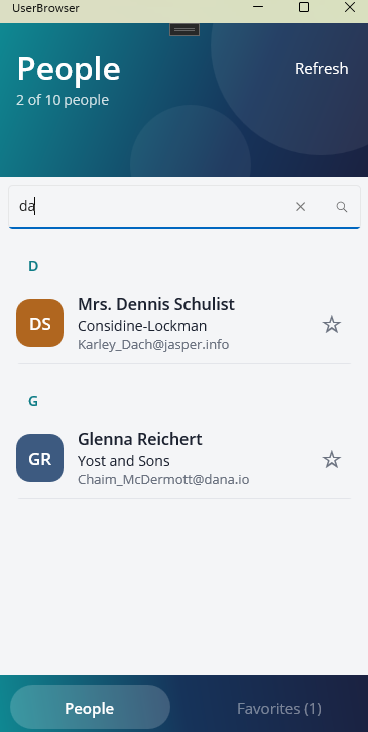
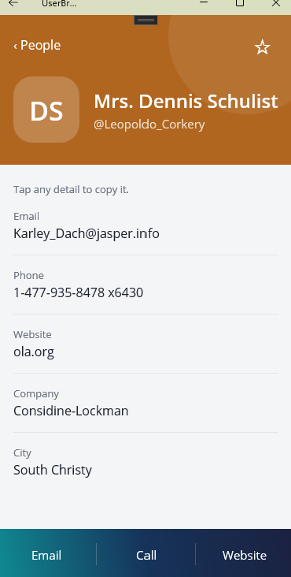

# UserBrowser: .NET MAUI + MVVM sample

A small .NET MAUI people directory that loads users from a public REST API (JSONPlaceholder).
Built to practice MVVM, data binding, dependency injection, Shell navigation and unit testing.

<p align="center">
  
  &nbsp;
  
  &nbsp;
  
</p>
<p align="center"><em>List, live search, and detail page (Windows)</em></p>

## Features
- Gradient header and a bottom tab bar (People / Favorites) with a sliding highlight
- List grouped by first letter, with a colored initials tile per person
- Live search across name, company, email and city
- Favorites: star a person, filter to favorites, and they are remembered between launches
- Detail page with email, call and website actions, and tap-to-copy on each detail
- Loading, empty, no-match and error states that say what to do next
- Light and dark themes that follow the system setting
- Pull-to-refresh, plus a Refresh button for mouse users

## Stack
- .NET 10, .NET MAUI (built and run on the Windows target)
- CommunityToolkit.Mvvm (`[ObservableProperty]`, `[RelayCommand]`)
- xUnit for ViewModel tests

## Architecture
```
Views (XAML)  <-- binding -->  ViewModels  -->  Services (interfaces)  -->  REST API
                                    |
                                  Models
```
| Folder | Contents |
|---|---|
| `Models/` | `User`, `Company`, `Address` records |
| `Services/` | `IApiService`/`ApiService` (HttpClient), `INavigationService`/`ShellNavigationService`, `IFavoritesStore`/`PreferencesFavoritesStore` |
| `ViewModels/` | `UsersViewModel` (search, filter, grouping, loading and error state), `UserItem` (a user plus initials, color, favorite), `UserGroup`, `UserDetailViewModel` |
| `Views/` | `UsersPage`, `UserDetailPage` (XAML, minimal code-behind) |

Key points:
- ViewModels depend on **interfaces** and get them by **constructor injection** (`MauiProgram.cs`).
- Navigation is behind `INavigationService`, so ViewModels contain no UI types and are testable.
- Compiled bindings (`x:DataType`) on every page.
- Loading, error and empty states are driven by ViewModel properties (`IsBusy`, `ErrorMessage`, `HasError`).

## Run
```
cd UserBrowser
dotnet run -f net10.0-windows10.0.19041.0
```
(Or open `UserBrowser.csproj` in Visual Studio, choose **Windows Machine**, press F5.)
Requires the .NET 10 SDK and the MAUI workload (`dotnet workload install maui`).

## Test
```
cd UserBrowser.Tests
dotnet test
```
24 tests cover loading, busy and error states, grouping, search, favorites (including
persistence), navigation, and the initials/color logic. They use hand-written fakes
rather than a mocking library.

The test project links the UI-free source files instead of referencing the MAUI project
(which multi-targets Windows/Android/iOS). Moving them into a shared class library would be
the cleaner next step.

## License
[MIT](LICENSE)

## Ideas for next steps
- A `Posts` list per user (the API has `/posts?userId=`)
- Retry with `Polly` / resilient `HttpClient`
- Android emulator run, plus `OnPlatform` layout tweaks
- CI build with GitHub Actions
